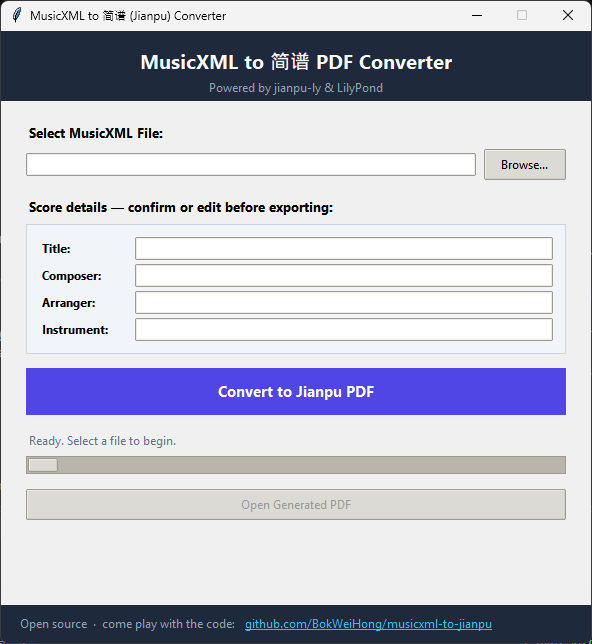

# MusicXML to Jianpu (简谱) PDF Converter / MusicXML 转简谱 PDF 工具



## English

This is a small Windows desktop app that turns MusicXML files into numbered musical notation (jianpu / 简谱) PDFs. It saves the finished PDF right next to your original file.

If you play instruments like guzheng, erhu, or pipa and need clean practice sheets without standard western staves, this makes the conversion quick.

Here is what runs under the hood:

* **jianpu_ly** handles the translation from MusicXML to numbered notation.
* **LilyPond** engraves the notes and builds the PDF.

Everything runs locally on your PC. No web servers, no uploads, and no internet required.

---

### What it does

* **One-click conversion:** Select a `.musicxml`, `.xml`, or `.mxl` file, and you get a `<name>_jianpu.pdf` in the same folder.
* **Editable headers:** The app auto-detects title, composer, arranger, and instrument. You can change or delete them before exporting.
* **Readable Chinese text:** It applies SimHei for bold titles and KaiTi for Chinese markings so characters display properly.
* **Patched for tricky scores:** Stock `jianpu_ly` often crashes on real files. We patched it to handle 128th notes, odd tuplets (like 7:8), and multi-part files.
* **No file lock crashes:** If your PDF viewer already has the file open, it writes `_jianpu_2.pdf` instead of failing.
* **Even bar lines:** The indent on the first system is removed, so every printed line starts its bars at the same left edge.
* **Bigger note numbers:** The jianpu digits are rendered noticeably larger — only the numbers (and the `0` rest), never the dynamics, Chinese marks or title.
* **Rests are zeros:** every rest beat prints as `0` (whole rest → `0 0 0 0`, half rest → `0 0`); the `–` dash is kept only for held notes. A run of silent bars still stays combined into a single multi-measure rest (`|--5--|`) to save space.
* **Adjustable bar numbers:** pick how often measure numbers are printed (every 1/2/3/5/10 bars) or turn them off with the **Bar numbers** dropdown.
* **No console flash:** converting from the installed app no longer pops up a command window.
* **Updates itself:** the installed app checks GitHub on startup; when a newer release exists it offers **Update now**, downloads the new installer, installs it silently and reopens by itself. (Links are in the header: `v<version> · Check for updates`.)

---

### How it works

1. Pick a file in the app and tweak the score details if needed.
2. The app cleans up the XML in a temporary folder (your original file is never touched).
3. It runs our patched in-memory version of `jianpu_ly` to create a LilyPond (`.ly`) file.
4. It tweaks fonts, dynamic marks, and headers in the `.ly` text.
5. It runs LilyPond in the background to build the PDF.

The conversion runs on a worker thread, so the interface stays responsive while LilyPond works.

---

### Quick start (running from source)

You will need:

* Windows
* Python 3.9 or newer (with `tkinter` enabled)
* LilyPond (added to your system `PATH`, pointed to by a `LILYPOND` environment variable, or placed as a portable `lilypond-2.26.0` folder inside the project root)

```powershell
cd D:\jianpu

# Set up virtual environment
python -m venv .venv

# Install dependencies
.venv\Scripts\pip install -r requirements.txt

# Run the app
.venv\Scripts\python app_gui.py

```

You can also just double-click `run.bat`.

To test conversion directly from PowerShell without the GUI:

```powershell
.venv\Scripts\python -c "from jianpu_converter import convert_musicxml_to_jianpu; print(convert_musicxml_to_jianpu('samples\\your_score.musicxml'))"

```

---

### How to use the app

1. Click **Browse…** and choose your score file.
2. Check the **Score details** section. Update the title, composer, or instrument if anything looks off. Empty fields stay blank in the output. Below them, use the **Bar numbers** dropdown to choose how often measure numbers are printed (or turn them off).
3. Click **Convert to Jianpu PDF**.
4. Once finished, click **Open Generated PDF** to review the result.

---

### Sharing with others

To share this with friends on Windows, give them `release\JianpuConverter-Setup-1.0.1.exe`.

* Installs per-user without requiring admin privileges.
* Creates desktop/start shortcuts and associates `.musicxml` files.
* Since the executable is not code-signed, SmartScreen might show a warning. Tell them to click **More info** and then **Run anyway**.
* **After that you never have to send them anything again:** new versions are announced inside the app (see "Publishing an update" below).

#### Publishing an update (friends then update themselves)

1. **Bump the version** (updates `__init__.py`, the installer script, README and `release\README.txt`):
   ```powershell
   .venv\Scripts\python bump_version.py patch      # 1.0.0 -> 1.0.1 (or minor / major / 1.2.3)
   ```
2. **Rebuild** the exe and installer:
   ```powershell
   .venv\Scripts\python patch_jianpu_ly_src.py
   .venv\Scripts\python -m PyInstaller JianpuConverter.spec
   Copy-Item -Recurse -Force lilypond-2.26.0 dist\JianpuConverter\
   tools\nsis\nsis-3.09\makensis.exe installer\JianpuConverter.nsi
   ```
3. **Publish it to GitHub** — either with the helper (one command):
   ```powershell
   set GITHUB_TOKEN=ghp_your_token        # classic token with the "repo" scope
   .venv\Scripts\python publish_release.py --notes "what changed"
   ```
   …or by hand: GitHub → **Releases → Draft a new release** → tag `v1.0.1`
   (create the tag on publish, target `main`) → attach
   `release\JianpuConverter-Setup-1.0.1.exe` → **Publish release**.

That's it. Every installed app checks `api.github.com/.../releases/latest` about a
second after it starts, and its owner just clicks **Update now**. The tag **must**
look like `v1.0.1` and the release must **not** be a draft or pre-release, or the
app will ignore it.

#### Building the installer from source

```powershell
cd D:\jianpu

# 1. Generate patched files for the standalone build
.venv\Scripts\python patch_jianpu_ly_src.py

# 2. Package with PyInstaller
.venv\Scripts\python -m PyInstaller JianpuConverter.spec

# 3. Copy portable LilyPond next to the new executable
Copy-Item -Recurse -Force lilypond-2.26.0 dist\JianpuConverter\

# 4. Compile the installer with NSIS
tools\nsis\nsis-3.09\makensis.exe installer\JianpuConverter.nsi

```

The completed setup will be in `release\`.

---

### Project structure

* `app_gui.py` — Thin entry launcher.
* `jianpu_converter/gui.py` — Tkinter user interface.
* `jianpu_converter/convert.py` — Pipeline coordinator.
* `jianpu_converter/musicxml.py` — Reads XML, unzips `.mxl`, and normalizes odd notations.
* `jianpu_converter/layout.py` — LilyPond post-processing (fonts, headings, markings).
* `jianpu_converter/patches.py` — Bug fixes for upstream `jianpu_ly`.
* `jianpu_converter/lilypond.py` — Finds the LilyPond binary and manages its cache.
* `jianpu_converter/updater.py` — Looks for a newer GitHub release, downloads the installer, runs it silently.
* `patch_jianpu_ly_src.py` — Build helper for the PyInstaller bundle.
* `bump_version.py` — Writes a new version into every file that stores it.
* `publish_release.py` — Creates the GitHub release and uploads the installer.

---

### Notes on the patches

Stock `jianpu_ly` breaks on several real-world scores (such as 128th notes and unusual tuplets).

When running from Python source, the app patches `jianpu_ly` dynamically in memory. Because PyInstaller bundles compiled bytecode, runtime source patching cannot happen in the frozen `.exe`.

`patch_jianpu_ly_src.py` solves this. If you edit replacements in `jianpu_converter/patches.py`, run `patch_jianpu_ly_src.py` before rebuilding your installer so the changes carry over.

---

### Limitations

* **Notation limits from jianpu_ly:** Complex ornaments, uncommon tuplets, and dense polyphony might be simplified.
* **Font dependencies:** The template targets `SimHei` and `KaiTi` on Windows. If missing, LilyPond falls back to system fonts.
* **Compilation time:** Scores with heavy runs or wide chords take longer for LilyPond to engrave.
* **Numbered notation only:** This tool outputs clean jianpu sheets; it does not retain western staves.

---

## 中文说明

这是一个轻量级的 Windows 桌面工具，可以将 MusicXML 格式的五线谱文件转换为**简谱 PDF**，生成的文件会自动保存在原乐谱同一目录下。

如果你平时练习古筝、二胡、中阮或琵琶，需要把五线谱转成纯数字简谱，用这个工具转换很方便。

核心依赖组件：

* **jianpu_ly**：负责将 MusicXML 结构解析并转为简谱 LilyPond 语法。
* **LilyPond**：负责简谱排版和最终生成 PDF 文件。

所有处理都在本地电脑完成，不需要联网，也不会上传任何曲谱数据。

---

### 功能特点

* **一键导出：** 选择 `.musicxml`、`.xml` 或 `.mxl` 文件，直接在旁边输出 `<文件名>_jianpu.pdf`。
* **乐谱信息修改：** 自动读取曲目名、作曲、作词和乐器名称。导出前可以直接在界面修改或清空。
* **中文字体适配：** 默认使用黑体（SimHei）排版大标题、楷体（KaiTi）排版谱面文字标注，避免中文出现方块或乱码。
* **常见解析报错修复：** 原版 `jianpu_ly` 处理复杂乐谱时容易崩溃，本项目修复了 128 分音符、特殊连音（如 7:8）以及多声部音高判定问题。
* **防止文件占用冲突：** 如果原本生成的 PDF 正在阅读器中打开，会自动命名为 `_jianpu_2.pdf` 写入，不会提示崩溃。
* **小节线左右对齐：** 已取消第一行的缩进，让每一行的起始小节都对齐到同一左侧边线。
* **数字更大更清晰：** 只放大谱面中的简谱数字（以及休止符 `0`），不会影响强弱记号、中文标注和标题大小。
* **休止符统一为 0：** 每个休止拍都写成 `0`（全休止 `0 0 0 0`，二分休止 `0 0`），`–` 只用于音符的延长。连续多小节的休止仍会合并成一个连休标记（如 `|--5--|`），保持版面紧凑。
* **小节号可自定义：** 在 **Bar numbers** 下拉框中设置每 1/2/3/5/10 小节显示一次小节号，也可以选择完全不显示。
* **不再弹出命令行窗口：** 安装版转换时不会再闪出黑色 cmd 窗口。
* **自动更新：** 安装版启动后会检查 GitHub，发现新版本时提示 **Update now**，自动下载并静默安装，然后重新打开自己。标题右上角有 `v版本号 · Check for updates` 可以随时手动检查。

---

### 转换流程

1. 在界面中选好乐谱文件，核对或修改曲目信息。
2. 程序在临时目录清洗 XML 结构（完全不改动原始文件）。
3. 调用修复后的 `jianpu_ly` 内存模块生成 `.ly` 脚本。
4. 调整 `.ly` 文件中的中文字体、强弱记号大小与表头排版。
5. 后台调用 LilyPond 编译输出 PDF。

后台多线程独立工作，编译乐谱时界面不会卡死。

---

### 源码运行方式

运行环境要求：

* Windows 系统
* Python 3.9 或更高版本（安装时勾选 `tcl/tk and IDLE`）
* LilyPond 编译环境（已加入系统环境变量 `PATH`、设置了 `LILYPOND` 变量，或在项目根目录放置便携版 `lilypond-2.26.0` 文件夹）

```powershell
cd D:\jianpu

# 创建虚拟环境
python -m venv .venv

# 安装依赖项
.venv\Scripts\pip install -r requirements.txt

# 启动软件
.venv\Scripts\python app_gui.py

```

也可以直接双击目录下的 `run.bat`。

如果不想打开图形界面，想直接在命令行测试转换：

```powershell
.venv\Scripts\python -c "from jianpu_converter import convert_musicxml_to_jianpu; print(convert_musicxml_to_jianpu('samples\\your_score.musicxml'))"

```

---

### 使用步骤

1. 点击 **Browse…** 选择曲谱文件。
2. 查看 **Score details** 面板。如果识别的歌名、作者或乐器有误，可以直接在输入框修改；删空的内容在导出的 PDF 里也会留空。下面的 **Bar numbers** 下拉框可以选择小节号的显示频率（也可以关闭）。
3. 点击 **Convert to Jianpu PDF** 开始转换。
4. 转换完成后，点击 **Open Generated PDF** 查看生成的简谱。

---

### 分享安装包

如果要把工具发给其他人使用，直接发送 `release\JianpuConverter-Setup-1.0.1.exe` 即可：

* 安装在当前用户目录下，不需要管理员权限。
* 自动创建桌面与开始菜单快捷方式，并关联 `.musicxml` 文件（支持双击直接打开）。
* 因为个人打包没有购买企业代码签名证书，Windows SmartScreen 可能会弹出安全提醒，点击 **更多信息** 然后选择 **仍要运行** 即可。
* **以后就不用再发新安装包给他们了：** 新版本会在软件内提示（见下面“发布新版本”）。

#### 发布新版本（朋友那边会自动更新）

1. **修改版本号**（会同时更新 `__init__.py`、安装脚本、README 和 `release\README.txt`）：
   ```powershell
   .venv\Scripts\python bump_version.py patch      # 1.0.0 -> 1.0.1（也可用 minor / major / 1.2.3）
   ```
2. **重新打包** exe 和安装包：
   ```powershell
   .venv\Scripts\python patch_jianpu_ly_src.py
   .venv\Scripts\python -m PyInstaller JianpuConverter.spec
   Copy-Item -Recurse -Force lilypond-2.26.0 dist\JianpuConverter\
   tools\nsis\nsis-3.09\makensis.exe installer\JianpuConverter.nsi
   ```
3. **发布到 GitHub**，可以用脚本一条命令完成：
   ```powershell
   set GITHUB_TOKEN=ghp_你的令牌        # 需要带 "repo" 权限的 classic token
   .venv\Scripts\python publish_release.py --notes "本次更新内容"
   ```
   也可以手动操作：GitHub → **Releases → Draft a new release** → 标签填 `v1.0.1`
   （发布时创建标签，目标选 `main`）→ 上传
   `release\JianpuConverter-Setup-1.0.1.exe` → **Publish release**。

完成后，所有已安装的软件在启动约 1 秒后会查询
`api.github.com/.../releases/latest`，朋友只要点一下 **Update now** 就升级好了。
注意：标签必须是 `v1.0.1` 这种格式，而且不能保存为 draft 或 pre-release，否则软件会忽略它。

#### 本地构建安装包

```powershell
cd D:\jianpu

# 1. 预先生成已打补丁的 jianpu_ly 文件
.venv\Scripts\python patch_jianpu_ly_src.py

# 2. 使用 PyInstaller 打包二进制文件
.venv\Scripts\python -m PyInstaller JianpuConverter.spec

# 3. 将便携版 LilyPond 拷贝到输出目录
Copy-Item -Recurse -Force lilypond-2.26.0 dist\JianpuConverter\

# 4. 使用 NSIS 编译生成安装程序
tools\nsis\nsis-3.09\makensis.exe installer\JianpuConverter.nsi

```

生成的安装包在 `release\` 目录下。

---

### 代码结构

* `app_gui.py` — 轻量启动入口。
* `jianpu_converter/gui.py` — Tkinter 图形界面。
* `jianpu_converter/convert.py` — 转换主流程调度。
* `jianpu_converter/musicxml.py` — 读取 XML、解压 `.mxl` 并清理特殊音符标记。
* `jianpu_converter/layout.py` — LilyPond 文本排版优化（字体、标题、符号）。
* `jianpu_converter/patches.py` — `jianpu_ly` 库的补丁映射与修复规则。
* `jianpu_converter/lilypond.py` — 自动查找 LilyPond 路径并清理字库缓存。
* `jianpu_converter/updater.py` — 检查 GitHub 新版本、下载安装包并静默运行。
* `patch_jianpu_ly_src.py` — 专为 PyInstaller 打包构建使用的静态补丁生成脚本。
* `bump_version.py` — 一键修改所有存放版本号的文件。
* `publish_release.py` — 创建 GitHub Release 并上传安装包。

---

### 关于补丁机制的说明

原版 `jianpu_ly` 遇到 128 分音符或特定连音节奏时会出现解析错误。

直接通过 Python 源码运行时，程序会自动在内存中热修复这些方法。但 PyInstaller 打包后全部为编译字节码，无法直接修改源码。

因此提供了 `patch_jianpu_ly_src.py`。如果你后续在 `jianpu_converter/patches.py` 中增加了新的修补规则，打包前必须先运行该脚本重新生成补丁文件，否则打出来的 `.exe` 依然会走旧版逻辑。

---

### 使用注意

* **记谱规则受底层限制：** 特殊装饰音、极复杂连音或多声部织体可能会进行合理简化。
* **系统字体要求：** 默认依赖 Windows 系统的黑体（SimHei）和楷体（KaiTi）。如果没有安装，LilyPond 会自动调用默认字体替代。
* **复杂曲目排版较慢：** 音符密度极高或琶音极多的乐谱，LilyPond 排版用时较长，状态栏显示处理中时耐心等待即可。
* **仅生成纯简谱：** 软件设计目标为纯数字简谱，不保留上方的五线谱对照。